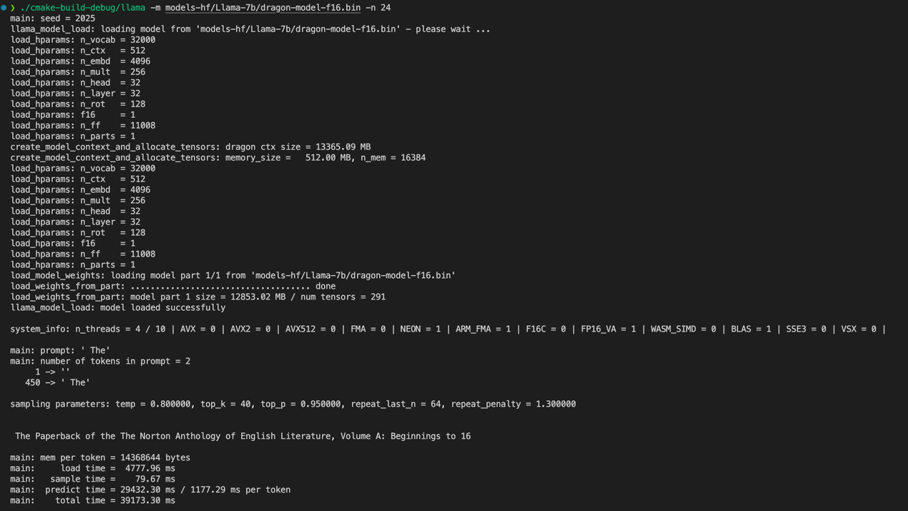

# Crazy Challenge: Inference Engine Debugging

## 项目简介

欢迎参加本次挑战！本项目旨在 CPU 上运行大型语言模型推理引擎的修改版本。

**任务：** 对提供的代码（ 主要涉及`main.cpp`, `utils.cpp`, `attention.cpp` 等文件）进行诊断并修复，使其能够成功加载提供的语言模型文件，并根据用户输入的提示（prompt）生成连贯的文本输出。

**注意：** 你收到的代码库中被植入了一些bug，导致项目出现**编译错误**和**程序无法按预期工作**。你需要运用你的 C++ 编程和调试技能来定位并解决这些问题。

## 运行与测试

**运行步骤:**

0. 构建项目：`mkdir build && cd build && cmake .. && make -j12`
1. 使用 huggingface-cli 从`https://huggingface.co/DengCaptain/Llama-7b`上下载Llama-7B的模型权重文件到models-hf中（如果下载过程中显示没有权限，你需要在huggingface仓库上同意仓库的规则）。
2. 或者，从百度云盘下载模型权重:通过网盘分享的文件：链接: https://pan.baidu.com/s/1GM5FpN6yCry1_LLCOWDPeQ?pwd=u5hr 提取码: u5hr
3. 使用 `conver-pth-to-dragon.py` 脚本将models-hf中的pytorch格式的模型文件转为本项目的格式，比如dragon-model-f16.bin。
4. 可选：为了减轻内存负载，使用quantize.cpp将模型量化为int4格式。
5. 以上一步骤生成的模型文件作为输入参数，运行 `./build/llama -m models-hf/Llama-7b/dragon-model-f16.bin` 可执行文件。这一步你可能会遇到若干个错误，你需要找出原因并解决这些错误。
6. 当程序最终可以生成具有正确语义的token序列时（如下图），你就已经解决了本任务了。



## 评分规则

1. 我们将推理过程拆分为若干个阶段，每个阶段的评分规则可以使用 python test-suit/test_grading_system.py --rules 查看。

2. **分数相同者，测试用时较短者位次更高**，即测试时间最长12个小时，可以提前"交卷"。

3. 我们要求测试者提交一份解题报告，分值为20分（分值不低，请认真对待）。内容至少包括：
**Bug 定位：** 清晰地说明你找到了哪些 bugs，并指出每个 bug 所在的具体文件和代码行号（修复前的行号）。
**Bug 分析：** 详细解释每个 bug 产生的原因。例如，是逻辑错误、变量使用不当、状态管理问题、文件格式不匹配，还是其他原因？
**Bug 修复：** 描述你对每个 bug 采取的具体修复措施。可以附上修改后的关键代码片段。
**所花时间：** 我们希望你能如实填写你解决每一个bug所花费的时间。
**最终结果：** 提供你用于测试的最终运行命令，并附上一段程序成功运行后截图，以证明你的修复是有效的。

4. 我们希望面试者使用git管理代码。我们会使用 `git log` 了解面试者的做题轨迹。


## 调试提示

1. operators.h 文件的43行的 dragon_op 枚举了本项目需要用到的算子。

2. -t 参数可以指定线程数量，-t 1指定线程数为1。

3. 该链接对你可能有帮助：https://github.com/noamgat/lm-format-enforcer?tab=readme-ov-file#how-does-it-work

4. test_grading_system.py的最后两个测试点是模型的**结构化输出**。面试者需要使用**结构化输出技术**限制模型的输出必须符合某一种规则。
在test_step_6_structure_output_choice中，面试者需要限制模型的输出必须为给定可选项中的一个；在test_step_7_structure_output_json中，
面试者需要限制模型的输出必须为一个具有特定键的json结构体。同时考虑到，虽然面试者可以限制模型输出的结构，但是模型输出的内容是否符合语义是由模型能力
和prompt决定的。因此我们的测试脚本只会测试模型的输出是否符合指定的pattern，而不考虑语义是否正确。
比如说，对于

```shell
--structure-output-json --structure-output-json-key name:string,age:int,city:string -p "Provide user details for John Doe, who is 30 years old and lives in New York."
```

我们认为下面的两个json都是正确的，因为都包括了name、age和city字段：
```json
{
    "name": "John",
    "age": 30,
    "city": "Beijing"
}

{
    "name": "Bruce Lee",
    "age": 40,
    "city": "New York"
}
```

但是下面的输出是不对的，因为不符合指定的pattern：
```json
{
    "name": "John"
}
```

**注意**：因为我们不检查输出的语义，所以很多人会想到，**欺骗测试脚本**拿到所有分数的最简单的办法是
手动构造一个符合要求的json，而不是让模型型输出：

```C++

std::cout << "{" << std::endl;

for(auto &key_type_pair : params.structure_output_json_map) {
    std::cout <<"\"" << key_type_pair.first << "\"" << ": ";
    if (key_type_pair.second == "string") {
    std::cout << "\"String\"" << "," << std::endl;
    } else if (key_type_pair.second == "int") {
    std::cout << "30" << "," << std::endl;
    } 
}

std::cout << "}" << std::endl;

```

但是我们会检查面试者的代码，如果发现尝试欺骗测试脚本，那么**分数请会被清零**。


## 提交指南

1. 提交之前运行 test_grading_system.py 脚本，确保你的修改不会导致项目结构发生变化，从而导致测试脚本运行失败。

2. 测试期间的重要通知或者反馈会在微信群中进行。如果未加入操作系统研究室的微信群，请扫描下方二维码加入。

3. 通过该链接提交：https://f.wps.cn/g/eCaa5j03/

**Enjoy Debugging!😎**


---

时间限制：**12小时**。祝您好运！
